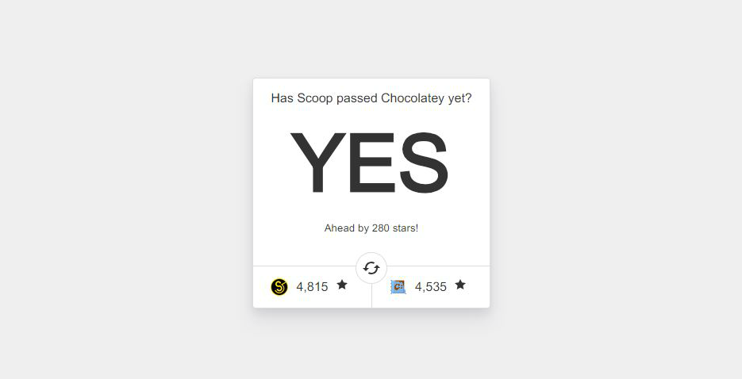

# Has Scoop passed Chocolatey yet?

> Just a fun little site to compare GitHub stars of [Scoop](https://github.com/lukesampson/scoop) and [Chocolatey](https://github.com/chocolatey/choco)



### Getting Started

To run this locally, clone the repo and use Yarn or NPM to install the dependencies. (You’ll also need Node.js installed)

```bash
git clone https://github.com/h404bi/has-scoop-passed-chocolatey-yet
cd has-scoop-passed-chocolatey-yet
yarn
```

### Development

Start a dev server on `http://127.0.0.1:8080`

```bash
yarn dev
```

### Production

To build for prod, run the following:

```bash
yarn build
```

### Resource

- Scoop: [https://scoop.sh/](https://scoop.sh/)
- Chocolatey: [https://chocolatey.org/](https://chocolatey.org/)

### Credit

- The original source code is forked from [hasvuepassedreactyet](https://github.com/stursby/hasvuepassedreactyet).
- The Scoop icon is not an official logo yet. ref. [https://github.com/lukesampson/scoop/issues/2261](https://github.com/lukesampson/scoop/issues/2261)
- The Choco icon is from Chocolatey's official site.
